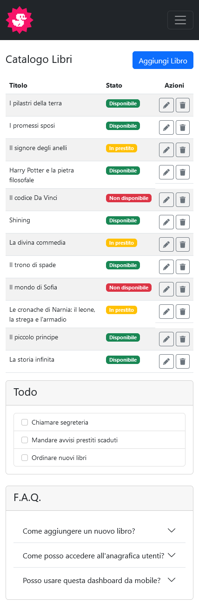
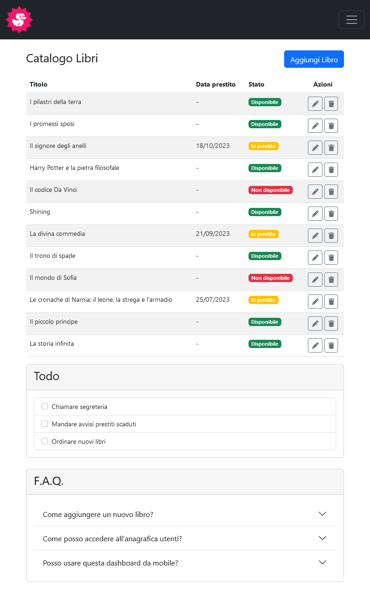
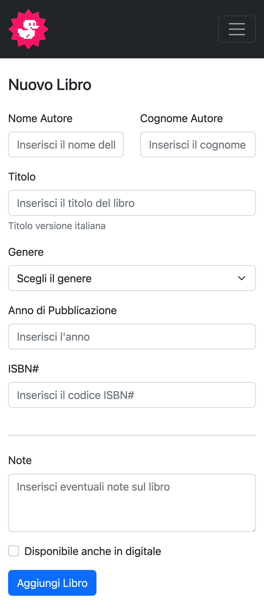
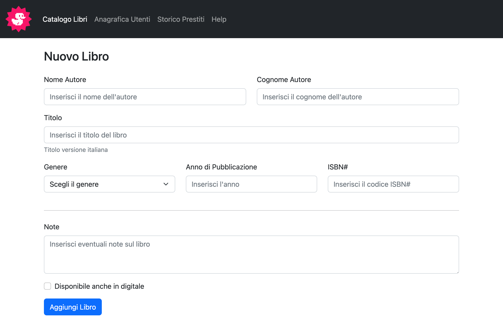

# HTML / CSS BOOTSTRAP LAYOUT

This project is the seventh exercise of the Web Development Master Course.The project focuses on mastering **Bootstrap 5** by building a complex, responsive, and accessible interface without relying on extensive custom CSS.

## TASK

The primary goal of this project was to replicate a specific professional UI layout provided by the instructor while strictly adhering to modern web standards:
- **Mobile-First Approach**: Designing for small screens first and scaling up using Bootstrap’s responsive suffixes (`sm`, `md`, `lg`).
- **Component Mastery**: Implementing dynamic Navbars, responsive data tables, utility cards, and complex forms.
- **Clean Architecture**: Utilizing semantic HTML tags to ensure a clean and accessible structure.

## PROJECT STRUCTURE

```text
Htmlcss-bootstrap-dashboard/
├── img/
│   └── duck.png             # Project Logo and Favicon
├── screenshot/
│   ├── desktop.png          # Dashboard Desktop View
│   ├── tablet.png           # Dashboard Tablet View
│   ├── mobile.png           # Dashboard Mobile View
│   ├── desktop-new-book.png # Add Book Page Desktop View
│   └── mobile-new-book.png  # Add Book Page Mobile View
├── index.html               # Main Catalog Dashboard
├── index-add-book.html      # Add New Book Form Page
├── .gitignore               # Standard git ignore file
└── README.md                # Project Documentation


## REFERENCE WEBPAGES
## Dashboard (Book Catalog)
### MOBILE


### TABLET


### DESKTOP


## Add New Book Form
### MOBILE


### DESKTOP


## TECH STACK
* HTML5: semantic elements
* Bootstrap 5: properties / classes / layouts 
* VSCode: IDE